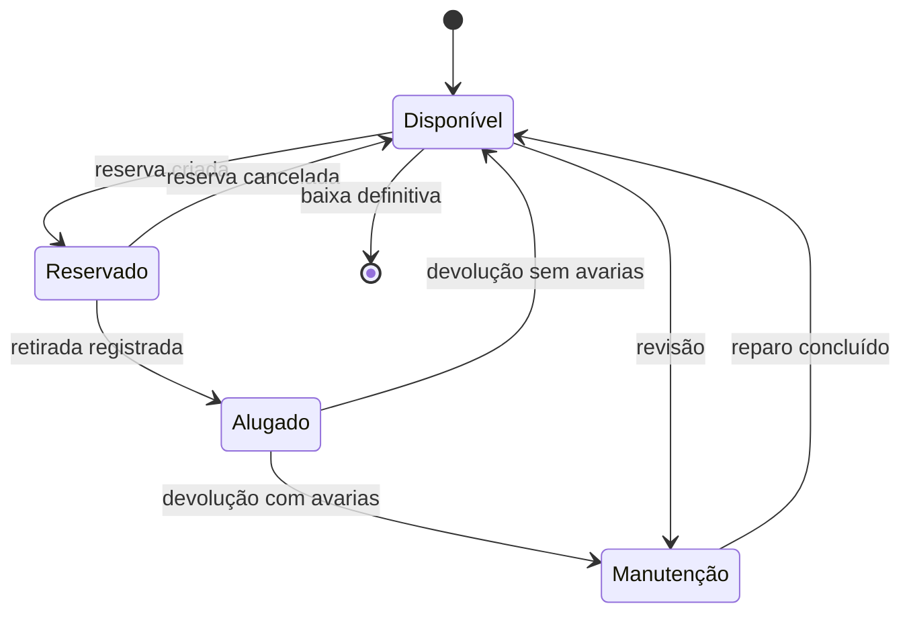
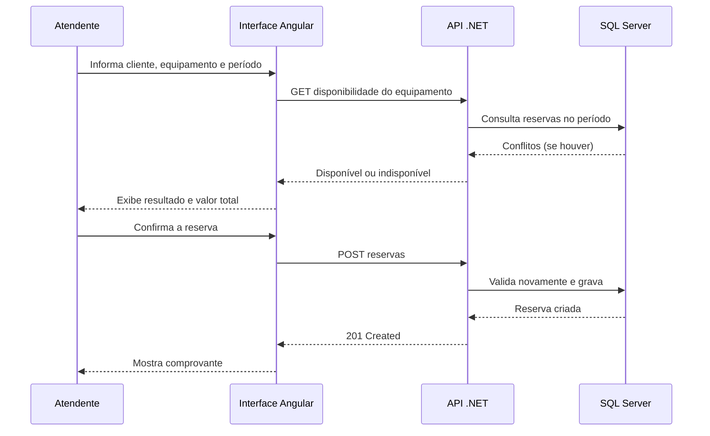
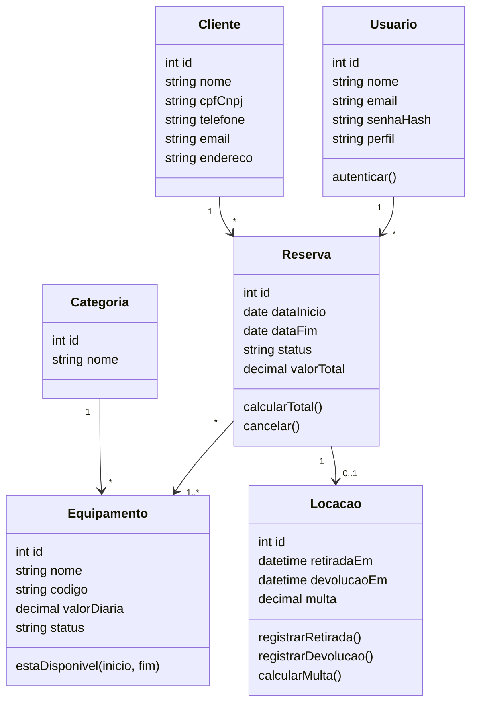

# RentWise

Sistema web de gestão de aluguel de equipamentos para pequenas locadoras que ainda controlam reservas em cadernos, planilhas ou aplicativos de mensagem.

**Instituição:** Fatec
**Curso:** Desenvolvimento de Sistemas
**Professor:** Analdo
**Integrante:** Gustavo de Oliveira Pignata

## Problema

Pequenos locadores (festas e eventos, ferramentas, câmeras e som) costumam controlar o negócio manualmente. Isso causa reservas duplicadas, devoluções esquecidas, multas não cobradas e falta de visão sobre quais itens rendem mais. O RentWise oferece uma forma simples de saber o que está disponível, com quem está e quando volta.

## Objetivos

- Evitar conflitos de reserva para o mesmo equipamento
- Registrar retirada e devolução com precisão
- Calcular valores e multas por atraso automaticamente
- Manter histórico por cliente e por equipamento
- Gerar relatórios simples para o dono do negócio

## Atores

| Ator | Papel |
|---|---|
| Administrador | Gerencia equipamentos, usuários e relatórios |
| Atendente | Cadastra clientes, cria reservas, registra retiradas e devoluções |
| Cliente | Solicita reservas e consulta disponibilidade (via atendente) |

## Funcionalidades

- Login e cadastro de usuários
- Cadastrar, editar e excluir equipamentos
- Cadastrar e editar clientes
- Consultar disponibilidade por data
- Criar reservas com cálculo do valor total
- Registrar retirada e devolução
- Alertas e multa de atraso
- Histórico de aluguéis
- Relatórios (faturamento, itens mais alugados, clientes frequentes)

## Requisitos

**Funcionais**
- RF01: cadastro e login de usuários
- RF02: CRUD de equipamentos
- RF03: cadastro e edição de clientes
- RF04: verificar disponibilidade por período
- RF05: impedir reservas sobrepostas
- RF06: calcular o valor total da reserva
- RF07: registrar retirada e devolução
- RF08: calcular multa por atraso
- RF09: listar locações em atraso
- RF10: histórico e relatórios

**Não funcionais**
- Interface web responsiva
- Senhas com hash e comunicação via HTTPS
- Controle de acesso por perfil
- Telas principais respondendo em menos de 3 segundos
- Interface simples para usuários não técnicos

## Regras de negócio

- RN01: um equipamento não pode ter duas reservas ativas com períodos sobrepostos
- RN02: valor da reserva = diária x número de dias (mínimo 1 dia)
- RN03: multa por atraso calculada por dia (sugestão: 20% da diária ao dia)
- RN04: equipamento em manutenção não pode ser reservado
- RN05: só o Administrador exclui equipamentos e gerencia usuários
- RN06: equipamento com histórico não é apagado, apenas marcado como baixado

## Tecnologias

| Camada | Tecnologia |
|---|---|
| Backend | C# com .NET (API REST) |
| Frontend | Angular, TypeScript, HTML5 e CSS3 |
| ORM | Entity Framework Core |
| Banco de dados | SQL Server |
| Protótipo | Figma |
| Versionamento | Git e GitHub |

## Diagramas UML

### Diagrama de estados - Equipamento

### Diagrama de sequência - Criar reserva

### Diagrama de classes

## Modelo de dados

Tabelas principais: Usuarios, Clientes, Categorias, Equipamentos, Reservas, ReservaItens e Locacoes.

## Telas planejadas

Login, Registro, Painel, Equipamentos, Cadastro de equipamento, Clientes, Nova reserva, Retirada e devolução, Relatórios.

## Pesquisa de campo

Roteiro de entrevista com locadoras para validar o escopo (resultados em elaboração).

## Cronograma

1. Tema, escopo e pesquisa de campo
2. Requisitos e diagramas UML
3. Protótipo no Figma
4. Banco de dados e backend
5. Frontend e integração
6. Testes e documentação
7. Apresentação final

## Colaborador

- Gustavo de Oliveira Pignata# RentWise
